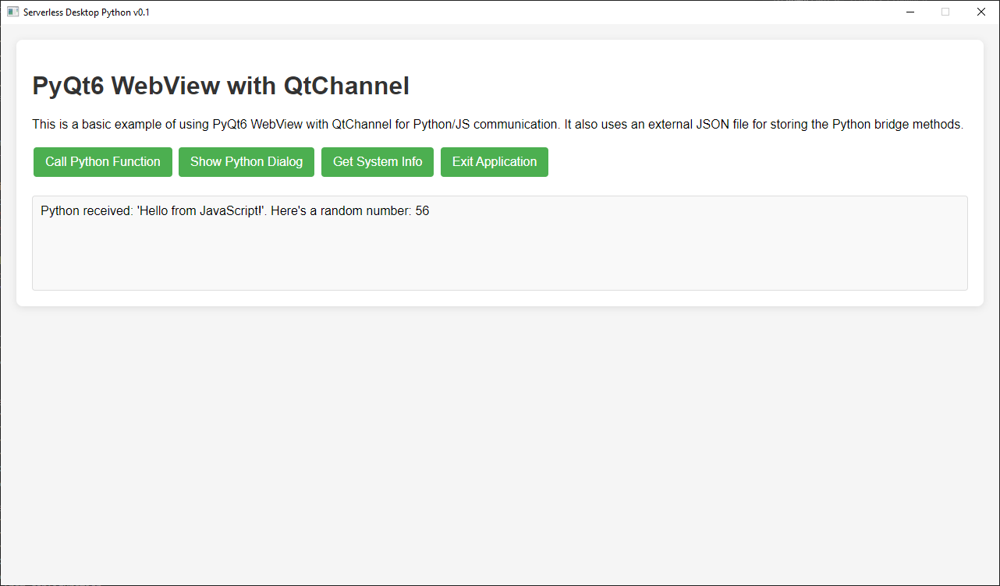

# Serverless-Desktop-Python
A serverless desktop python demo for games and apps

## Screenshot

## Features

- **Python/JS Bridge**: Communication bridge for Python->JS and JS->Python with 4 examples.
- **External Methods Example**: An example of using python code in a JSON file.

## Installation

You can install the dependencies using pip:

\`\`\`
pip install PyQt6 PyQtWebEngine

pip install numpy
\`\`\`

## Usage

1. Clone this repository:
   \`\`\`
   git clone https://github.com/non-npc/Serverless-Desktop-Python.git
   cd Serverless-Desktop-Python
   \`\`\`

2. Run the application:

   \`\`\`
   python main.py
   \`\`\`

## NOTES
This project uses the python bridge methods in an external JSON file.
This is so that you can distribute the compiled EXE and JSON file together without having to modify the compiled EXE, each time you want to make a change to the config or a method based on changes in your HTMl/JS.

## Contributing

Contributions are welcome! If you'd like to contribute to the project, feel free to open an issue or submit a pull request.

## License

This project is licensed under the MIT License. See the [LICENSE](LICENSE) file for more details.

